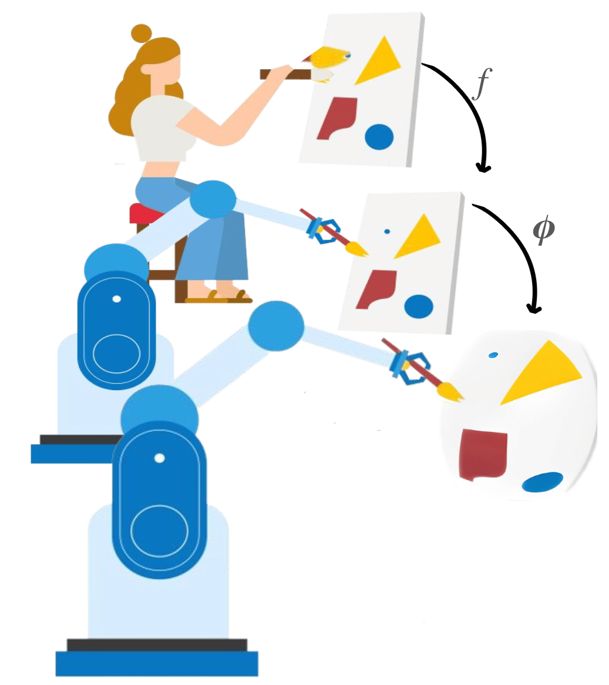
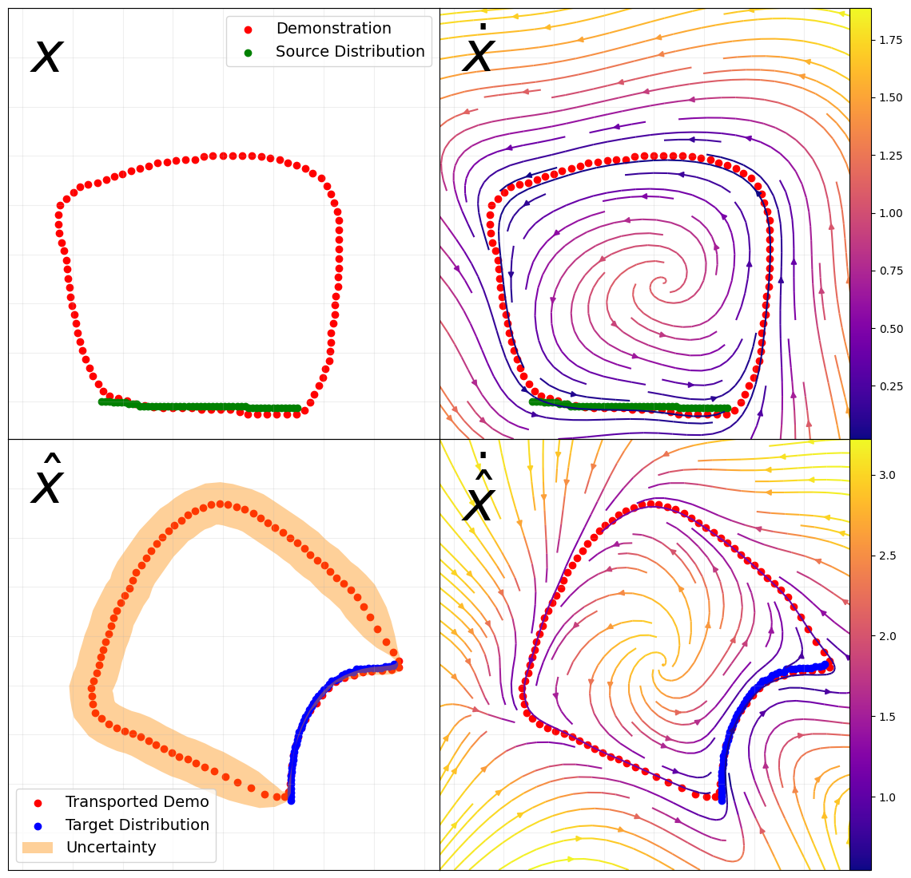

# Generalizable Motion Policies through Keypoint Parameterization and Transportation Maps (TRO 2025)



This is the code accompaning the paper Generalizable Motion Policies through Keypoint Parameterization and Transportation Maps published in Transaction of Robotics (2025).

In this article, we parameterize the space with keypoints—for example, the shoulder, elbow, wrist, and hand positions of a human during dressing, or keypoints of an object being manipulated and its goal. We then fit a differentiable map $\phi$ to model the transportation between these keypoints. We use the map to generalize the original position, velocity and orientation labels. 


Many function approximators are available as transportation methods. 

## Minimal Example: Generalizing Labels with Transportation Maps

Below is a minimal code example demonstrating how we generalize position and velocity labels using transportation maps and Gaussian Process Regression (GPR) as the function approximator for the map.

```python
# Define the transportation map and kernel
transport = PolicyTransportation()

# Set up the GPR method
k_transport = C(constant_value=10) * RBF([0.1, 5]) + WhiteKernel(0.01)
method = GPR(k_transport)

# Specify which method the transportation should use
transport.set_method(method=method, is_residual=method.is_residual)

# Fit the transportation map between source and target keypoint distributions
transport.fit(source_distribution, target_distribution)

# Generalize position and velocity labels
X_hat, X_hat_std = transport.transport(X)
deltaX_hat, deltaX_hat_var = transport.transport_velocity(X, deltaX)
```

This example shows how to fit a transportation map and use it to generalize both position (`X_hat`) and velocity (`deltaX_hat`) labels for new data together with the associated uncertainty due to the generalization. 

The list of available methods to fit the transportation map that are colelcted in `policy_tranportation/models` are
| Method Name         | Call it                |
|---------------------|------------------------------|
| Gaussian Process    | `GPR(kernel)`                |
| Locally Weighted Regressin      | `Iterative_Locally_Weighted_Translations(num_iterations=30)`     |
| Radial Basis Function Regression      | `RBFRegression( beta=20, sigma2=0.001)`                |
| Ensamble Bijective Flow   | `EnsembleBijectiveNetwork(num_epochs=200, n_estimators=10)`         |
| Ensamble Neural Network      | `EnsembleNeuralNetwork(num_epochs=200, n_estimators=10)`                |


# Installation
This is a simple python package. You can install it in editable mode with. 
```
pip install -e . 
```
# Citation

```
Franzese, Giovanni, et al. "Generalizable Motion Policies through Keypoint Parameterization and Transportation Maps." IEEE Transactions on Robotics (2025).
```

